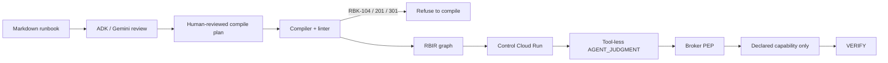

# Runbook Compiler

Reference implementation of the **Runbook Compiler (RBIR v0.1)** and **RunbookBench (v0.1)** research suite, based on [`spec.md`](./spec.md).

**Hackathon track:** Fortified Enterprise Fleet — [All Things Agentic](https://allthingsagentichackathon.devpost.com/). Gemini 3.5 interprets. Google ADK hosts tool-less interpreter agents. Cloud Run, Firestore, Pub/Sub, and KMS execute only capabilities declared in the manifest.

## Architectural Invariant

> **The model may interpret reality. It may not invent authority.**  
> $\text{Knowledge} \neq \text{Judgment} \neq \text{Authority} \neq \text{Action}$  
> $\text{AGENT\_JUDGMENT} \cap \text{ACTION} = \emptyset$



## Repository Layout

- `packages/`
  - `schemas/`: Canonical JSON Schema Draft 2020-12 definitions (`rbir/v0.1`, `rb-capabilities/v0.1`, `rb-diagnostic/v0.1`, `runbookbench/v0.1`).
  - `types/`: Shared TypeScript types and Zod schemas (`@runbook/types`).
  - `compiler/`: Deterministic runbook compiler, AST analyzer, and `rbc` CLI (`@runbook/compiler`).
  - `bench/`: RunbookBench formal evaluation harness and metrics (`@runbook/bench`).
- `apps/`
  - `control/`: Cloud Run state machine runtime and Firestore controller (`@runbook/control`).
  - `broker/`: Cloud Run Action Broker Policy Enforcement Point (PEP) (`@runbook/broker`).
  - `acme-worker/`: Mock capability provider with fault injection (`@runbook/acme-worker`).
  - `console/`: Operator Web UI (React + Vite) (`@runbook/console`).
- `infra/`
  - `docker/`: Local Docker Compose with Firestore and Pub/Sub emulators.
  - `terraform/`: GCP infrastructure modules (Cloud Run, Firestore, Pub/Sub, KMS, IAM).
- `fixtures/`
  - Canonical Markdown runbooks, capability manifests, and benchmark test corpora.

## Getting Started

```bash
# Install dependencies across monorepo workspaces
pnpm install

# Build all packages and services
pnpm build

# Run type checks
pnpm typecheck
```

## Local implementation path

The repository includes an offline reviewed-plan compiler and a local vertical
slice for the Acme fixture. A compile plan is intentionally explicit: prose
extraction remains advisory and cannot silently create capability bindings.

```bash
pnpm local:compile       # writes .local/acme-ingestion-recovery.rbir.json
node packages/compiler/dist/cli.js review RUNBOOK.md --responses recorded-model-response.json
node packages/compiler/dist/cli.js review RUNBOOK.md --live
pnpm local:smoke          # compiled RBIR -> control runner -> broker -> worker -> VERIFY
pnpm local:http-smoke     # Control HTTP endpoint -> Broker HTTP -> Worker -> VERIFY
pnpm local:gemini-smoke   # same path with live Gemini 3.5 classifying telemetry (needs GEMINI_API_KEY)
pnpm local:fault-smoke    # transient, malformed, injection, auth, replay, and 404 checks
pnpm local:bench          # validate and score the pilot corpus
pnpm local:pubsub-smoke   # publish/pull a resume envelope through the emulator
pnpm local:approval-audit-smoke # Firestore-backed approval and audit HTTP flow
pnpm local:cloud-guard-smoke # cloud mode exposes health only and rejects authority routes
pnpm local:stack:config   # validate Docker Compose configuration
docker compose -f infra/docker/docker-compose.yml build
CONSOLE_PORT=4174 docker compose -f infra/docker/docker-compose.yml up
# broker metrics are available at http://localhost:8081/metrics
```

The local smoke path uses an in-memory operation/replay store and local RSA
signing. The Compose stack adds Firestore and Pub/Sub emulators, but cloud IAM,
KMS, Secret Manager, immutable retention, and multi-region behavior remain
deployment-only concerns.

## Deployed demo

The bounded GCP demo is currently in security-containment mode: the public
Console remains available, while cloud Control exposes health only and all
execution/approval/resume routes fail closed until a trusted production
authority and identity-admission path is implemented. Current infrastructure
controls, historical execution evidence, and remaining gates are recorded in
[`docs/deployment-evidence-2026-08-27.md`](./docs/deployment-evidence-2026-08-27.md).
