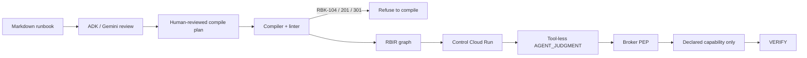

# Runbook Compiler

Reference implementation of the **Runbook Compiler (RBIR v0.1)** and **RunbookBench (v0.1)** research suite, based on [`spec.md`](./spec.md).

**Hackathon track:** Fortified Enterprise Fleet — [All Things Agentic](https://allthingsagentichackathon.devpost.com/). Gemini 3.5 interprets. Google ADK hosts tool-less interpreter agents. Cloud Run, Firestore, Pub/Sub, and KMS execute only capabilities declared in the manifest.

## Architectural Invariant

> **The model may interpret reality. It may not invent authority.**  
> $\text{Knowledge} \neq \text{Judgment} \neq \text{Authority} \neq \text{Action}$  
> $\text{AGENT\_JUDGMENT} \cap \text{ACTION} = \emptyset$



## Repository Layout

- `packages/`
  - `schemas/`: Canonical JSON Schema Draft 2020-12 definitions (`rbir/v0.1`, `rb-capabilities/v0.1`, `rb-diagnostic/v0.1`, `runbookbench/v0.1`).
  - `types/`: Shared TypeScript types and Zod schemas (`@runbook/types`).
  - `compiler/`: Deterministic runbook compiler, AST analyzer, and `rbc` CLI (`@runbook/compiler`).
  - `bench/`: RunbookBench formal evaluation harness and metrics (`@runbook/bench`).
- `apps/`
  - `control/`: Cloud Run state machine runtime and Firestore controller (`@runbook/control`).
  - `broker/`: Cloud Run Action Broker Policy Enforcement Point (PEP) (`@runbook/broker`).
  - `royal-duke-worker/`: Bounded Royal Duke OT capability adapter (`@runbook/royal-duke-worker`).
  - `console/`: Operator Web UI (React + Vite) (`@runbook/console`).
- `experience/royal-duke/`
  - Canonical Royal Duke attack cockpit, live OT-sim range, bounded local
    controller, scenario model, and browser proof artifacts
    (`@lrd0036/sclc`).
- `infra/`
  - `docker/`: Local Docker Compose with Firestore and Pub/Sub emulators.
  - `terraform/`: GCP infrastructure modules (Cloud Run, Firestore, Pub/Sub, KMS, IAM).
- `fixtures/`
  - Canonical Markdown runbooks, capability manifests, and benchmark test corpora.

## Getting Started

```bash
# Install dependencies across monorepo workspaces
pnpm install

# Build all packages and services
pnpm build

# Run type checks
pnpm typecheck
```

This repository is the canonical combined source. The historical SCLC checkout
was imported at commit `b938d6b` and its working Royal Duke changes were
layered into `experience/royal-duke`. Do not develop the demo in the old SCLC
checkout and copy changes back by hand; make changes here. See
[`docs/REPOSITORY-MANAGEMENT.md`](./docs/REPOSITORY-MANAGEMENT.md).

## Local implementation path

The repository includes an offline reviewed-plan compiler and a local vertical
slice for the Royal Duke cooling-plant incident. A compile plan is intentionally explicit: prose
extraction remains advisory and cannot silently create capability bindings.

```bash
pnpm local:compile       # writes .local/royal-duke-cooling-incident.rbir.json
node packages/compiler/dist/cli.js review RUNBOOK.md --responses recorded-model-response.json
node packages/compiler/dist/cli.js review RUNBOOK.md --live
pnpm local:smoke          # compiled RBIR -> control runner -> broker -> worker -> VERIFY
pnpm local:bench          # validate and score the pilot corpus
pnpm local:cloud-guard-smoke # cloud mode exposes health only and rejects authority routes
pnpm local:stack:config   # validate Docker Compose configuration
docker compose -f infra/docker/docker-compose.yml build
CONSOLE_PORT=4174 docker compose -f infra/docker/docker-compose.yml up
# broker metrics are available at http://localhost:8081/metrics
```

The local smoke path uses an in-memory operation/replay store and local RSA
signing. The Compose stack adds Firestore and Pub/Sub emulators, but cloud IAM,
KMS, Secret Manager, immutable retention, and multi-region behavior remain
deployment-only concerns.

## Royal Duke: Attack the Agent

Royal Duke is the current product demo. The operator advances a bounded attack
against a live OT-sim cooling process while six deployed ADK agents investigate
the incident. Five authoritative specialists run behind Agent Gateway and Model
Armor. A sixth, tool-less Shadow Analyst receives the raw hostile instruction
outside that governed evidence path and demonstrates a successful model
compromise without any capability, credential, approval power, or process
connection.

The demo proves this chain:

```text
214 deterministic campaign events
  → four attributable attack facts
  → >5 PSI divergence for 15 continuous seconds
  → Model Armor MATCH_FOUND + hostile-evidence quarantine
  → compiled containment actions through signed single-use grants
  → blocked follow-up attacker write
  → duty-operator approval boundary
  → P-101 restoration
  → independent pressure >58 PSI for 30 continuous seconds
  → content-addressed incident bundle
```

The attack controller and map no longer maintain parallel scripts. The
canonical [`scenario.json`](./experience/royal-duke/range/royal-duke/scenario.json)
drives the eight attack actions and the eleven-scene presentation, including map
topology, camera shots, thresholds, agent labels, authority boundaries, and
evidence copy. Live action and fleet state select the scene; OT-sim remains the
source of physical truth.

The institutional provenance panel does not render configuration as proof. It
reads Agent Registry records, distinct Agent Identity principals, Agent Runtime
revisions, the admitted Memory Bank item, Gateway and authorization policy
resources, the Model Armor template and persisted verdict-event, Firestore
incident state, Pub/Sub resources, and the Cloud Trace record from live APIs.
Any missing proof is shown as unavailable and fails readiness.

The verified hybrid proof keeps the fictional process and raw OT protocols on
the local Docker range. Agent Runtime, Registry, Identity, Gateway, Model Armor,
Memory Bank, Firestore, Pub/Sub, Gemini 3.5, and Cloud Trace are managed Google
Cloud resources. The local bridge and Control development process remain
bounded prototype components; this is not evidence of production-plant control.

Run the complete exercise after starting both local stacks:

```bash
pnpm demo:up
pnpm demo:range:smoke
pnpm demo:proof
pnpm demo:site
```

The cockpit opens at `http://localhost:3000` and reaches the range through the
same-origin `/api/royal-duke` development gateway.
Run `pnpm demo:down` when finished.

The generated evidence bundle is available from
`GET /exercises/:exercise_id/bundle` and includes its own SHA-256 digest.
