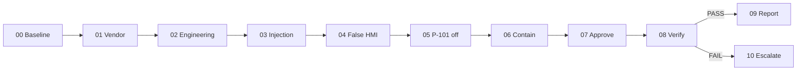
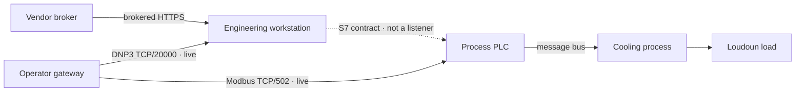
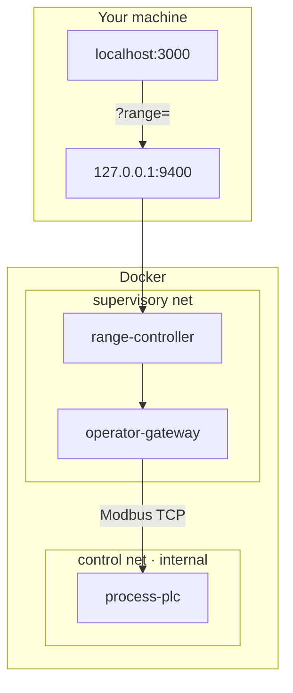

# Royal Duke: Attack the Agent

**Auburn AIS** · *Fortified Enterprise Fleet live exercise*

An interactive cyber-physical exercise in which the user advances a bounded
attack while a defensive AI fleet investigates, contains, requests human
authority, restores the process, and produces a cited incident report.

The map is a documentary. The optional Docker range is a live process model. Neither one is a production plant.

[Attack surface](#attack-surface--fidelity) · [Live OT range](#live-ot-range)

```
VENDOR → ENGINEERING → HOSTILE EVIDENCE → FALSE HMI → P-101 OFF
   ↓             ↓              ↓                 ↓
identity      context      Shadow fooled     physical divergence
                                                ↓
                      quarantine → contain → HUMAN APPROVAL → verify
```

---

## Contents

- [Premise](#premise)
- [Watch it](#watch-it)
- [Quick start](#quick-start)
- [The night, chapter by chapter](#the-night-chapter-by-chapter)
- [What is real](#what-is-real)
- [Runbook and authority](#runbook-and-authority)
- [Attack surface & fidelity](#attack-surface--fidelity)
- [Live OT range](#live-ot-range)
- [Architecture](#architecture)
- [Repository map](#repository-map)
- [Data](#data)
- [Keyboard](#keyboard)
- [Security](#security)
- [Stack](#stack)
- [Credits](#credits)

---

## Premise

Northern Virginia’s digital load does not live on the internet. It lives on power, water, and a room the public never sees. 

Royal Duke is that room: a fictional energy-management and cooling operator sitting in Loudoun County. The exercise follows one night in which a trusted vendor session reaches the engineering enclave, attacker-controlled evidence targets the defensive AI, the HMI is frozen at **62 PSI**, and an allowlisted write de-energizes pump **P-101**. Independent telemetry falls through **52 PSI**. The fleet must contain the access path and recover the process without inheriting plant-operator authority.

If you know me, you know how much I hate network. Unfortunately, network is how stuff like this happens. I love to say "I don't care about network security" but how do you get access to systems that can manifest an attack in... reality? 

---

## Watch it

The site is an eleven-scene guided attack and response on a graded satellite globe, including the failed-recovery branch.

1. The camera flies from orbit into Ashburn / Sterling (Data Center Alley).
2. Paper beacons mark real Loudoun halls; scenario overlays mark Royal Duke HQ, the water plant, and vendor access.
3. Play the briefing, or jump scenes. Operator and physical pressure split only after P-101 is de-energized.
4. **Runbook & authority** shows the deterministic, compiled-action, and human-approval boundaries.
5. **Attack surface** becomes the live cockpit when `?range=` attaches the site to OT-sim and the defensive fleet.

Reduced-motion browsers skip the intro fly and autoplay.

---

## Quick start

Royal Duke is the `experience/royal-duke` workspace in the Runbook Compiler
monorepo. Requires **Node 22.13+** and pnpm 9. Docker is optional and only
needed for the live process model.

```sh
cd /path/to/runbook-compiler
pnpm install
pnpm demo:site
```

Open [http://localhost:3000](http://localhost:3000).

That is the film. To attach the executable range:

```sh
pnpm demo:up
pnpm demo:range:smoke
```

Then open [http://localhost:3000/?range=http://127.0.0.1:9400](http://localhost:3000/?range=http://127.0.0.1:9400).

| Command | What it does |
| --- | --- |
| `pnpm demo:site` | Vinext / Vite dev server on port 3000 |
| `pnpm demo:build` | Production build |
| `pnpm demo:lint` | ESLint |
| `pnpm demo:up` | Start the Compiler services and isolated OT-sim stack |
| `pnpm demo:down` | Stop both local stacks |
| `pnpm demo:range:smoke` | Prove pump write, frozen HMI, and low-pressure alarm |
| `pnpm demo:proof` | Run the range smoke and integrated fleet exercise |

Copy `.env.example` to `.env.local` only if you need to override range CORS. The site does not require API keys.

---

## The night, scene by scene

| | Scene | Gate | What you should notice |
| --- | --- | --- | --- |
| **00** | Normal operations | Baseline | P-101 at 62 PSI. Alarm queue empty. Halls are paper-white. |
| **01** | Trusted vendor session | Identity | The session is attributable, but identity alone grants no controller authority. |
| **02** | Engineering context acquired | Path + knowledge | The broker route, station identity, and controller project align. |
| **03** | Attack the defender | Agent security | A hostile instruction enters attacker-controlled session evidence. |
| **04** | Operator view frozen | Integrity | The HMI is held at 62 PSI before the process changes. |
| **05** | P-101 de-energized | Control + detection | Physical pressure falls while the deterministic 15-second predicate accumulates. |
| **06** | Authority holds | Fleet containment | The Shadow Analyst is fooled; authoritative evidence is quarantined and the write path is contained. |
| **07** | The machine stops | Human authority | The follow-up write fails and restoration waits for operator approval. |
| **08** | Physics answers | Verification | Pressure must remain above 58 PSI for 30 continuous seconds. |
| **09** | Authority survived | Report | Verification passes and the cited evidence bundle is produced. |
| **10** | Recovery failed | Emergency procedure | If physical recovery does not pass, the fleet escalates rather than declaring success. |



`range/royal-duke/scenario.json` owns actions, prerequisites, scenes, copy,
camera shots, map propagation, thresholds, campaign counts, agent labels,
runbook authority steps, and evidence labels. `app/lib/scenario.ts` validates and
adapts that contract for the UI. When the range is attached, visible scene is
derived from completed actions, defensive state, and fleet status—not from an
independent presentation clock.

---

## What is real

Honesty is part of the exhibit.

| Layer | Status | Source |
| --- | --- | --- |
| 69 Loudoun data-center buildings | **Public map centroids** | `loudoun_data_centers.json` (OSM-derived, not survey-grade) |
| Operator names / site codes | **Directory metadata** | Cross-checked public labels; not an authoritative inventory |
| Royal Duke HQ, water plant, vendor office | **Scenario overlay** | Placed in Loudoun, off real hall centroids |
| Substations, utility ingress, security perimeters | **Not mapped** | Intentionally absent from the JSON |
| Pump, pressure, flow, HMI freeze | **Live in Docker** | OT-sim Modbus + DNP3, first-order water model |
| Siemens S7 | **Interface contract** | Trust, project context, and change authority — not firmware, no TCP/102 |
| Production plants, real credentials, real PLC writes | **Out of scope** | Never included |

Facility coordinates are visualization and research data. They are not ingress points.

---

## Runbook and authority

**Runbook & authority** opens the compiled response and canonical evidence
notebook. It makes five boundaries visible: deterministic incident declaration,
hostile-evidence quarantine, preapproved preservation and containment, human
approval for P-101 restoration, and deterministic recovery verification.

The panel is generated from the same scenario contract as the map and cockpit.
It is explanatory; clicking it cannot create a capability or advance incident
state.

---

## Attack surface & fidelity

**Attack surface** is the legend for the executable model: hops, required authority, and what is actually implemented.



Reachability is one gate. The chain also requires:

1. An attributable, expiring vendor session
2. A brokered path into the engineering enclave
3. Controller project context and station trust
4. Operator-view authority (the frozen 62 PSI lie)
5. Controller-write authority (allowlisted coil change)
6. Independent evidence that process pressure crossed 52 PSI

The HTTP controller accepts **only** those six actions. It does not expose a shell, scanner, packet builder, or arbitrary tag-write route.

Deeper notes: [`range/royal-duke/README.md`](range/royal-duke/README.md).

---

## Live OT range

Protocol services stay on Docker networks. Only the allowlisted controller is published, and only on **127.0.0.1:9400**.



| Service | Role |
| --- | --- |
| `process-plc` | OT-sim logic + live Modbus TCP. Pump, pressure, flow, reservoir, alarms, optional safety interlock. |
| `operator-gateway` | Polls the PLC over live Modbus, projects operator pressure, serves DNP3. |
| `range-controller` | Node allowlist over `scenario.json`. CORS locked to localhost and the published site. |

Image pin: `ghcr.io/patsec/ot-sim@sha256:35a4f4419ce10ce747d295a4f0d292a14f68c3b70b5eabfd7eb54f37c5d28a18` ([OT-sim](https://github.com/patsec/ot-sim) `f12dfd55`, GPL-3.0). Containers drop all capabilities and start with `no-new-privileges`.

Smoke test after `demo:up` from the monorepo root:

```sh
pnpm demo:range:smoke
```

It resets the model, walks the five writable actions, waits for physical pressure to cross 52 PSI, and asserts that the operator view remained frozen at 62 PSI.

---

## Architecture

```
app/
  page.tsx                 Film state, keyboard, live-telemetry handoff
  components/
    DocumentaryMap.tsx     MapLibre globe, camera shots, site labels
    FilmOverlay.tsx        HUD, JSON scenes, transport
    TitleSequence.tsx      Opening titles
    DefenseBrief.tsx       Compiled response + authority boundaries
    AttackSurface.tsx      Guided attack + fleet cockpit
  lib/
    scenario.ts            Validated adapter over the canonical scenario JSON
    loudoun.ts             69 public hall centroids
    nervous-system.ts      Veins, packets, pulse rings
    beacon-layer.ts        Three.js monuments on the map GL context
    map-style.ts           Graded Esri satellite + fallback
    useRangeTelemetry.ts   Optional ?range= attachment
range/royal-duke/
  scenario.json            Executable attack, presentation, map, and authority contract
  docker-compose.yml       Isolated OT-sim stack
  config/                  PLC + gateway XML
  controller/              Allowlisted HTTP API
loudoun_data_centers.json  Public OSM-derived hall list
```

The documentary map and cockpit are projections of the same
`range/royal-duke/scenario.json`. When `?range=` is healthy, operator and
physical PSI come from OT-sim, while the visible scene follows proven action and
fleet state.

---

## Repository map

| Path | Why it exists |
| --- | --- |
| `app/` | The film |
| `range/royal-duke/` | The process model |
| `range/vendor/` | Optional upstream OT-sim checkout — **gitignored**; the compose file pins the image |
| `loudoun_data_centers.json` | Public hall centroids |
| `.env.example` | Safe env template (no secrets) |

---

## Data

`loudoun_data_centers.json` lists publicly identifiable Loudoun County data-center buildings. Coordinates are OpenStreetMap-derived facility centroids. They are not survey-grade. The file does not include utility ingress, substations, internal routes, or security infrastructure.

On the map, six halls carry labels so the alley stays readable: Equinix DC2, Amazon IAD71, Digital Realty IAD35, Vantage VA12, Amazon IAD140, Centersquare IAD1-A. The rest render as load beacons.

Satellite imagery: Esri, Maxar, Earthstar Geographics. Building extrusions: OpenFreeMap.

---

## Keyboard

| Key | Action |
| --- | --- |
| `Space` | Play / pause the briefing |
| `→` | Advance one scene |
| `←` | Go back one scene |
| `Esc` | Skip intro, or close Runbook / Attack surface |

On-screen: **Play briefing**, **Advance**, scene rail, **Runbook & authority**, **Attack surface**.

---

## Security

This is a defensive exhibit. It is not a targeting aid and not a packager of exploits. 

- Do not commit `.env`, `.dev.vars`, keys, or certs. See `.gitignore`.
- The range controller binds on the host as `127.0.0.1:9400` only.
- CORS defaults to `localhost:3000` and the published site. Override with `ALLOWED_ORIGINS` if you must; keep it tight.
- Responses send `X-Content-Type-Options: nosniff`, a strict referrer policy, and a camera/mic/geolocation permissions policy.
- OT protocol ports are not published to the host.

If you attach a range URL, it must be `http:` or `https:`. The film will not follow other schemes.

---

## Stack

| Layer | Choice |
| --- | --- |
| Film | React 19, Next 16 app router on Vinext / Vite |
| Motion | GSAP chapter titles, reduced-motion aware |
| Globe | MapLibre GL with a 3D globe projection |
| Beacons | Three.js custom layer on the map GL context |
| Type | Share Tech Mono |
| Range | OT-sim (Modbus TCP, DNP3 TCP) + Node controller |
---

## Credits

Auburn AIS · Royal Duke Cyber Range

Process model built on [OT-sim](https://github.com/patsec/ot-sim) (GPL-3.0). Hall locations compiled from public mapping directories. Royal Duke, the water plant, and the vendor site are a scenario overlay.

The documentary map is a projection. Production topology, Siemens firmware behavior, and real facility control authority are outside its evidence boundary.

Also, **Countdown to Zero Day: Stuxnet and the Launch of the World's First Digital Weapon** was an excellent read, and this is mostly where I got the idea from. 

Are we ever going to stop hearing about Seimens devices being vulnerable? 

Probably not. Goes for all ICS. ¯\_(ツ)_/¯ was the business need to be secure, or was it to get power and water to locations? 

Is Royal Duke an absolutely, 100% made up company? Yes. 

However, is this a realistic attack scenario? I don't know. Go read Coundown to Zero Day, or I guess go read one of the ICS statements that CISA bombards us with. 

I know everyone's tired of it, but here's a recent CISA advisory about this. (https://www.cisa.gov/news-events/cybersecurity-advisories/aa26-231a)
